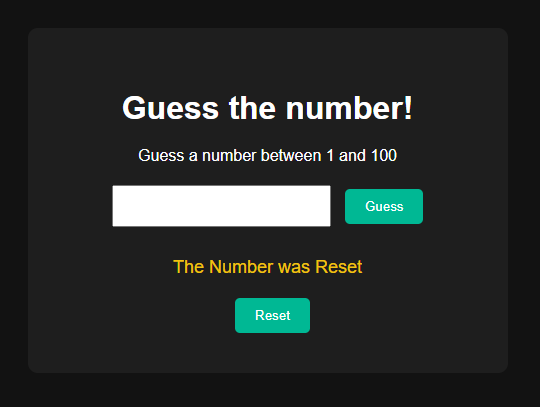

# 🎯 Guess the Number Game

Welcome to the **Guess the Number** game! This is a fun and interactive web-based number guessing game built using **HTML**, **CSS**, and **JavaScript**.

🔗 **Live Demo**: [Guess the Number](https://abhinav23055.github.io/Guess-the-number/)

## 🕹️ How to Play

- The computer randomly selects a number between 1 and 100.
- Your task is to guess the number in as few attempts as possible.
- You'll receive hints after each guess:
  - 📉 "Too low!" if your guess is less than the target number.
  - 📈 "Too high!" if your guess is greater than the target number.
  - ✅ "Congratulations!" if your guess is correct.

## 🚀 Features

- Random number generation
- Real-time input feedback
- Responsive and interactive UI
- Restart game functionality

## 🛠️ Built With

- **HTML5** – Structure and layout
- **CSS3** – Styling and responsiveness
- **JavaScript (Vanilla)** – Game logic and interactivity

## 📁 Project Structure

Guess-the-number/ ├── index.html ├── style.css └── script.js

## 📸 Screenshots

 <!-- Replace with your actual screenshot URL if available -->

## 🙌 Acknowledgements

- Inspired by beginner JavaScript projects and coding practice challenges.

## 📬 Contact

**Abhinav Gupta**  
📧 abhinavg9868@gmail.com  
🌐 [LinkedIn](https://www.linkedin.com/in/your-profile)

---

⭐ If you liked this project, don't forget to give it a star!
